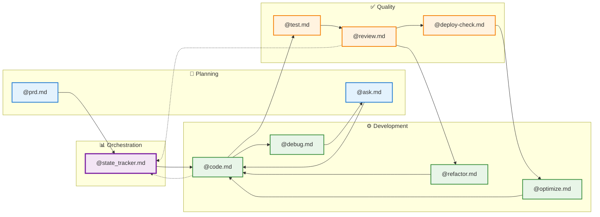
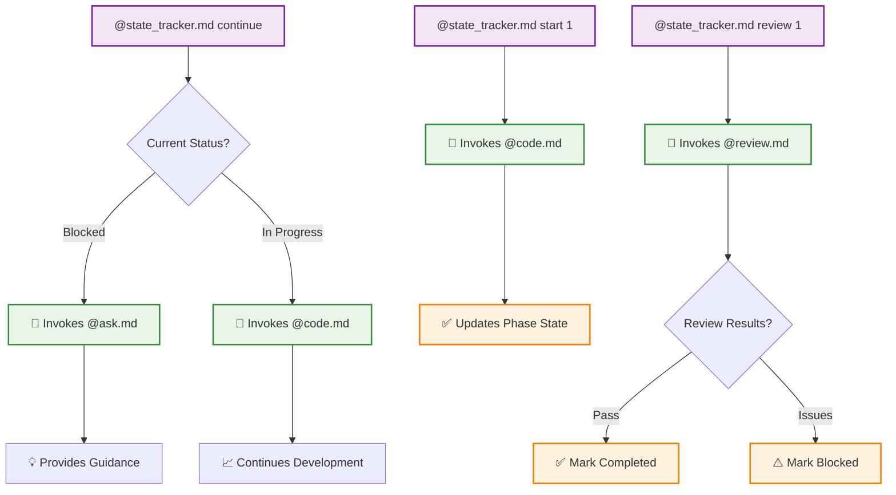

# Command Integration Ecosystem

Master the complete Claude Code command ecosystem through strategic integration patterns that create seamless, automated development workflows.

## Command Ecosystem Overview

Claude Code commands are designed as interconnected specialists that work together to create a complete development experience. Rather than isolated tools, they form an intelligent workflow orchestration system.

### Core Integration Philosophy

**Specialist Coordination**: Each command serves as a domain expert that can invoke other specialists when needed, creating a multi-agent development team.

**Context Preservation**: Information flows seamlessly between commands, maintaining project context and reducing cognitive overhead.

**Workflow Automation**: Commands automatically determine the next logical step, removing decision fatigue from development workflows.

## Complete Command Integration Flow



## Command Relationship Matrix

### Primary Command Categories

#### 🎯 **Strategic Planning Commands**
- **@prd.md** - Comprehensive product requirements with market analysis
- **@ask.md** - Senior architect consultation for technical decisions
- **@goals.md** - Detailed task breakdown and milestone tracking

#### 🔄 **Workflow Orchestration Commands**  
- **@state_tracker.md** - Central workflow coordinator with automated tool integration
- Manages phase transitions and automatically invokes other commands

#### ⚙️ **Implementation Commands**
- **@code.md** - Feature development with multi-agent coordination
- **@debug.md** - Systematic issue resolution and root cause analysis
- **@refactor.md** - Strategic code improvement and modernization
- **@optimize.md** - Performance enhancement with measurement

#### 🔍 **Quality Assurance Commands**
- **@test.md** - Comprehensive testing strategy and coverage
- **@review.md** - Multi-dimensional code quality assessment  
- **@deploy-check.md** - Production readiness validation

## Integration Patterns

### Pattern 1: Complete Project Lifecycle

```bash
# 1. Strategic Planning
@prd.md "Advanced Task Management Platform"
@ask.md "What's the best architecture for a scalable task management system?"

# 2. Development Setup  
@state_tracker.md create
@goals.md "Break down development into detailed tasks"

# 3. Phase-Based Development
@state_tracker.md start 1          # Invokes @code.md automatically
@state_tracker.md continue         # Resumes or gets guidance via @ask.md

# 4. Quality Assurance
@state_tracker.md state 1 completed
@state_tracker.md review 1         # Invokes @review.md automatically
@test.md "Phase 1 components"

# 5. Issue Resolution (if needed)
@debug.md "Authentication system issues"
@refactor.md "Improve authentication code structure"

# 6. Performance Optimization
@optimize.md "Database query performance"

# 7. Deployment Preparation
@deploy-check.md
@state_tracker.md state 1 deployed
```

### Pattern 2: Iterative Development Cycle

```bash
# Development Loop
@state_tracker.md start 2                    # Begin next phase
@code.md "User dashboard implementation"      # Core development

# Encounter Issue
@debug.md "Dashboard rendering problems"     # Issue resolution
@ask.md "Best practices for React state management"  # Get guidance

# Continue Development
@state_tracker.md continue                   # Resume with insights
@refactor.md "Apply state management improvements"   # Apply learnings

# Quality Gates
@test.md "Dashboard components and interactions"     # Testing
@review.md "Dashboard implementation"               # Code review
@optimize.md "Dashboard load performance"           # Performance

# Deploy
@deploy-check.md
@state_tracker.md state 2 deployed
```

### Pattern 3: Problem-Solving Workflow

```bash
# Issue Discovery
@debug.md "API response times are too slow"

# Get Expert Guidance
@ask.md "How to optimize API performance in Node.js applications?"

# Apply Solutions
@optimize.md "API endpoint performance based on recommendations"
@refactor.md "Restructure API code for better performance"

# Validate Improvements
@test.md "API performance and load testing"
@review.md "Optimized API implementation"

# Update Project State
@state_tracker.md state 3 completed
```

## State Tracker Orchestration Details

The `@state_tracker.md` command serves as the central workflow orchestrator. Here's how it automatically coordinates with other commands:



## Automated Integration Points

### State Tracker Orchestration

The `@state_tracker.md` command serves as the central orchestrator, automatically invoking other commands based on context:

#### **start** Action Integration
```bash
@state_tracker.md start 1
```
**Automatic Flow**:
1. Reads phase description from state tracker
2. Invokes `@code.md "Phase 1 description"`
3. Updates phase state to 🔄 In Progress
4. Tracks progress with timestamps

#### **continue** Action Integration
```bash
@state_tracker.md continue
```
**Smart Tool Selection**:
- **If blocked**: Invokes `@ask.md` for architectural guidance
- **If progressing**: Invokes `@code.md` for continued implementation
- **If debugging needed**: Suggests `@debug.md` usage
- **If optimization needed**: Suggests `@optimize.md` usage

#### **review** Action Integration
```bash
@state_tracker.md review 1
```
**Quality Assurance Flow**:
1. Marks phase as 🔍 Under Review
2. Invokes `@review.md "Phase 1 scope and implementation"`
3. Integrates review findings into phase documentation
4. Sets final state based on results (✅ or ⚠️)

### Code Command Coordination

The `@code.md` command coordinates with multiple specialists:

#### **Architecture Agent** → **@ask.md** Integration
When complex architectural decisions arise, `@code.md` can internally reference patterns from `@ask.md` consultations.

#### **Implementation Engineer** → **@debug.md** Integration  
If implementation encounters issues, the workflow naturally progresses to `@debug.md` for systematic resolution.

#### **Code Reviewer** → **@review.md** Integration
Implementation completion triggers quality validation through `@review.md`.

### Review Command Quality Gates

The `@review.md` command coordinates quality assurance:

#### **Quality Auditor** → **@refactor.md** Integration
Code quality issues trigger strategic refactoring recommendations.

#### **Performance Reviewer** → **@optimize.md** Integration
Performance bottlenecks identified in review lead to optimization workflows.

#### **Security Analyst** → **@debug.md** Integration
Security vulnerabilities require systematic debugging and remediation.

## Advanced Integration Techniques

### Technique 1: Conditional Command Chaining

```bash
# Smart conditional workflow
@state_tracker.md continue  # May invoke different commands based on state

# If phase is blocked → @ask.md for guidance
# If phase has bugs → @debug.md for resolution  
# If phase is slow → @optimize.md for performance
# If phase is messy → @refactor.md for cleanup
# If phase is untested → @test.md for coverage
```

### Technique 2: Context-Aware Tool Selection

```bash
# Context flows between commands
@prd.md "E-commerce Platform"              # Establishes project context
@state_tracker.md create                   # Uses PRD context for phases
@state_tracker.md start 1                  # Passes phase context to @code.md
@code.md                                   # Receives "Phase 1: Architecture" context
@review.md                                 # Receives implementation context
```

### Technique 3: Feedback Loop Integration

```bash
# Quality feedback drives continuous improvement
@code.md "Payment processing system"        # Initial implementation
@review.md "Payment processing"            # Identifies security issues
@debug.md "Payment security vulnerabilities" # Addresses specific issues
@refactor.md "Secure payment architecture"  # Improves overall structure  
@test.md "Payment security and functionality" # Validates improvements
@state_tracker.md state 2 completed       # Updates project progress
```

## Integration Benefits

### 🎯 **Reduced Cognitive Load**
- Commands automatically determine next logical steps
- Context flows seamlessly without manual intervention
- Decision fatigue eliminated through intelligent orchestration

### ⚡ **Accelerated Development Velocity**
- No context switching between planning and implementation
- Automated quality gates prevent technical debt accumulation
- Continuous feedback loops drive rapid improvement

### 🔍 **Enhanced Code Quality**
- Built-in review processes at every phase boundary
- Systematic issue resolution before problems compound
- Performance optimization integrated into development flow

### 🤝 **Team Alignment**
- Shared workflow patterns across team members
- Consistent quality standards through automated processes
- Clear visibility into project progress and technical decisions

### 📊 **Predictable Outcomes**
- Systematic approach reduces project risks
- Quality gates ensure deliverable standards
- Progress tracking enables accurate timeline management

## Best Practices for Command Integration

### 1. **Start with Strategic Foundation**
Always begin with `@prd.md` to establish clear project context that informs all subsequent commands.

### 2. **Use State Tracking as Central Orchestrator**
Let `@state_tracker.md` manage workflow progression rather than manually choosing commands.

### 3. **Trust Automated Integration Points**
Allow commands to invoke related commands automatically rather than micromanaging the process.

### 4. **Maintain Context Consistency**
Ensure project information flows naturally between commands without duplication or conflicts.

### 5. **Embrace Quality Gates**
Don't bypass review and testing phases - they prevent technical debt and improve long-term velocity.

### 6. **Document Integration Patterns**
Create team-specific integration patterns that reflect your project's unique requirements and constraints.

## Common Integration Anti-Patterns

### ❌ **Manual Context Recreation**
Don't manually re-explain project context to each command. Let context flow naturally through the integration system.

### ❌ **Skipping Quality Gates**
Don't bypass `@review.md` or `@test.md` to save time. Quality issues compound and slow down future development.

### ❌ **Isolated Command Usage**
Don't use commands in isolation. Leverage their integration capabilities for maximum effectiveness.

### ❌ **Ignoring State Tracker Guidance**
Don't ignore `@state_tracker.md help` recommendations. The orchestrator understands project context better than manual assessment.

This integrated command ecosystem transforms individual development tools into a cohesive, intelligent development team that guides projects from conception to deployment with minimal manual intervention and maximum quality assurance.