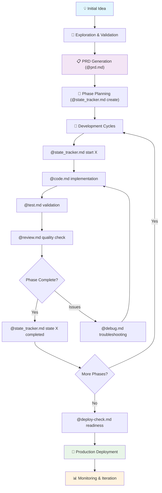

# From Idea to Production: Complete Development Journey

Master the end-to-end journey from initial concept to deployed application using Claude Code's powerful workflow orchestration.

## The Complete Journey Overview



## Real-World Example: TaskFlow SaaS Application

Let's walk through a complete project journey from initial idea to production deployment.

### Phase 1: Idea Exploration & Validation

**Initial Conversation:**
```
Developer: "I want to build a task management SaaS that's different from Todoist and Asana. 
I'm thinking about focusing on team productivity with smart automation features. 
Let me explore this idea with you first."

Claude: "Excellent! Let's explore this systematically. Let me think about what could make 
a task management SaaS truly differentiated..."

[Claude uses thinking mode to explore:]
- Current market gaps in task management
- Potential automation features
- Technical architecture considerations
- Target audience analysis
- Monetization strategies
```

**Key Discovery Questions:**
- What specific pain points exist in current solutions?
- Who is the target user persona?
- What automation features would provide real value?
- How will this integrate with existing workflows?
- What's the minimal viable product scope?

### Phase 2: PRD Generation & Strategic Planning

**Command Invocation:**
```bash
@prd.md "TaskFlow - Smart Task Management SaaS with AI-powered automation. 
Target small to medium teams (5-50 people) who struggle with task coordination 
and want intelligent workflow automation. Key features: smart task suggestions, 
automated progress tracking, team workload balancing, and integration hub."
```

**Generated PRD Structure:**
- **Executive Summary**: TaskFlow positioning and unique value proposition
- **Problem Statement**: Team coordination inefficiencies and manual overhead
- **Solution Overview**: AI-powered automation with human oversight
- **Target Audience**: SMB teams, remote workers, project managers
- **Technical Requirements**: React frontend, Node.js API, PostgreSQL, Redis
- **Timeline & Milestones**: 8-week development cycle with 6 major phases
- **Success Metrics**: User engagement, task completion rates, team productivity gains
- **Risk Analysis**: Competition, technical complexity, user adoption challenges

### Phase 3: Development Phase Planning

**Command Invocation:**
```bash
@state_tracker.md create "TaskFlow SaaS Development"
```

**Generated Development Phases:**
1. 📋 **Architecture & Database Design** (Week 1)
2. 📋 **Authentication & User Management** (Week 2) 
3. 📋 **Core Task Management Features** (Week 3-4)
4. 📋 **Team Collaboration & Permissions** (Week 5)
5. 📋 **AI Automation Engine** (Week 6)
6. 📋 **Integrations & API Development** (Week 7)
7. 📋 **Testing & Performance Optimization** (Week 8)
8. 📋 **Deployment & Monitoring Setup** (Week 8)

### Phase 4: Development Execution Cycles

#### Architecture Phase (Week 1)

**Starting the Phase:**
```bash
@state_tracker.md start 1
```

This automatically invokes:
```bash
@code.md "Design the overall system architecture for TaskFlow. Include:
- Database schema for users, teams, tasks, and automation rules
- API structure and endpoint planning  
- Frontend component architecture with React
- Real-time features architecture (WebSockets vs SSE)
- Authentication strategy (JWT with refresh tokens)
- Caching strategy with Redis
- File storage and media handling approach"
```

**Implementation Results:**
- Complete database schema with migrations
- API route structure with OpenAPI documentation
- React component hierarchy and state management plan
- WebSocket event system design
- JWT authentication implementation
- Redis caching layer configuration
- S3-compatible storage setup

**Quality Check:**
```bash
@state_tracker.md review 1
```

Automatically invokes `@review.md` for:
- Architecture scalability assessment
- Security vulnerability analysis
- Performance bottleneck identification
- Code maintainability evaluation

**Phase Completion:**
```bash
@state_tracker.md state 1 completed
```

#### Authentication System (Week 2)

**Development Cycle:**
```bash
@state_tracker.md start 2
# Implements complete authentication system
@test.md "Create comprehensive test suite for authentication"
@state_tracker.md review 2
@state_tracker.md state 2 completed
```

**Delivered Features:**
- User registration with email verification
- Secure login with JWT tokens and refresh mechanism
- Password reset workflow
- Two-factor authentication support
- Team invitation system
- Role-based access control foundation

#### Core Task Management (Weeks 3-4)

**Complex Feature Development:**
```bash
@state_tracker.md start 3
@code.md "Implement core task management functionality including:
- Task CRUD operations with rich metadata
- Task hierarchies and dependencies
- Due date tracking and notifications  
- Task assignment and ownership
- Progress tracking and status workflows
- Task filtering, sorting, and search
- Bulk operations and batch updates"
```

**Encountered Blocker:**
```bash
@state_tracker.md state 3 blocked
# Issue: Complex dependency resolution affecting performance

@state_tracker.md continue
# Automatically invokes @ask.md for architectural guidance

@ask.md "We're implementing task dependencies and hitting performance issues. 
When a parent task has 50+ subtasks, the dependency resolution is taking 2-3 seconds. 
What's the best approach for efficient dependency tracking?"
```

**Resolution and Continuation:**
```bash
@state_tracker.md state 3 progress
@code.md "Refactor task dependency system using the materialized path approach
recommended by the architecture advisor. Implement lazy loading for deep hierarchies."

@state_tracker.md state 3 completed
```

### Phase 5: Production Readiness & Deployment

#### Pre-Deployment Validation

**Comprehensive Readiness Check:**
```bash
@deploy-check.md "TaskFlow SaaS application ready for production deployment. 
Validate all systems, security, performance, and operational readiness."
```

**Generated Deployment Checklist:**
- ✅ Security audit and penetration testing
- ✅ Performance load testing (500 concurrent users)
- ✅ Database backup and recovery procedures
- ✅ Monitoring and alerting system setup
- ✅ CI/CD pipeline configuration
- ✅ Domain setup and SSL certificate installation
- ✅ Environment variable management
- ✅ Error tracking and logging configuration
- ✅ User documentation and support system

#### Deployment Execution

**Infrastructure Setup:**
```bash
@code.md "Set up production deployment infrastructure:
- Docker containerization for all services
- Kubernetes cluster configuration for scalability
- Database migration and seeding procedures
- Redis cluster for session and cache management
- Nginx reverse proxy with load balancing
- Automated SSL certificate management
- Health check endpoints for all services"
```

**Monitoring Implementation:**
```bash
@code.md "Implement comprehensive production monitoring:
- Application performance monitoring (APM)
- Database query performance tracking
- Real-time error alerting
- Business metrics dashboard
- User behavior analytics
- Infrastructure monitoring and alerting"
```

### Phase 6: Production Launch & Iteration

#### Launch Strategy

**Soft Launch Process:**
```bash
@code.md "Implement feature flag system for controlled rollout:
- Beta user invitation system
- Gradual feature enablement
- A/B testing infrastructure for key workflows
- Feedback collection and analysis system
- Performance monitoring during rollout"
```

**Post-Launch Monitoring:**
- Daily active users tracking
- Task creation and completion rates
- Team collaboration metrics
- Performance benchmarks
- Error rates and user-reported issues
- Feature adoption metrics

#### Continuous Improvement Cycle

**Feature Development Workflow:**
```bash
# New feature request from user feedback
@prd.md "Smart task prioritization feature based on user behavior patterns"
@state_tracker.md create "Task Prioritization Feature"
@state_tracker.md start 1
# Continue with established development cycle
```

## Key Success Patterns

### 1. **Strategic Planning First** 🎯
- Never skip the PRD generation step
- Use thinking mode to explore ideas thoroughly
- Validate assumptions before implementation
- Plan for scalability from the beginning

### 2. **Phase-Based Development** 🔄
- Break complex projects into manageable phases
- Maintain single focus per phase
- Use state tracking to maintain momentum
- Build quality gates at phase boundaries

### 3. **Integrated Quality Assurance** ✅
- Review every phase before advancement
- Automate testing and validation
- Address blockers systematically
- Maintain documentation throughout

### 4. **Production-Ready Mindset** 🚀
- Plan deployment strategy during architecture phase
- Implement monitoring and observability early
- Design for failure and recovery
- Validate readiness before launch

## Common Anti-Patterns to Avoid

### ❌ **Jumping to Implementation**
- Skipping exploration and planning phases
- Building without understanding requirements
- Ignoring architectural considerations

### ❌ **Phase Boundary Violations**
- Working on multiple phases simultaneously
- Advancing without proper validation
- Ignoring quality gates

### ❌ **Manual Workflow Management**
- Not using state tracking for complex projects
- Losing context between sessions
- Failing to document decisions and progress

### ❌ **Production Afterthoughts**
- Treating deployment as an afterthought
- Inadequate monitoring and alerting
- No rollback or recovery plan

## Advanced Techniques

### Multi-Project Orchestration

For enterprise environments managing multiple projects:

```bash
# Project coordination command
@goals.md "Coordinate TaskFlow development with mobile app and API integration projects.
Manage dependencies and shared resources across three development teams."
```

### Automated Quality Pipelines

Integration with CI/CD systems:

```bash
# Automated code review in pipeline
@review.md "Automated security and performance review for TaskFlow commit $(git rev-parse HEAD).
Focus on database query performance and authentication security."
```

### Context Preservation

For long-term projects spanning multiple months:

```bash
# Session resumption with context
@state_tracker.md help
# Provides current state and suggests next actions
# Maintains project momentum across interruptions
```

## Success Metrics

### Development Velocity
- **Time to First User**: 4 weeks from idea to beta
- **Feature Development**: 2-3 days per major feature
- **Bug Resolution**: 90% resolved within 24 hours
- **Code Quality**: 95%+ test coverage, 0 critical security issues

### Production Performance
- **Uptime**: 99.9% availability
- **Response Time**: <200ms average API response
- **User Satisfaction**: 4.8/5 rating from beta users
- **Team Productivity**: 40% improvement in task completion rates

This complete journey demonstrates how Claude Code's integrated workflow transforms chaotic development into predictable, high-quality product delivery. The key is embracing the systematic approach while maintaining creative flow through natural dialogue and intelligent automation.

## Related Topics

### Prerequisites
- [Getting Started](/getting-started) - Essential Claude Code setup
- [PRD Command](/commands/prd) - Product Requirements Document generation
- [State Tracker Command](/commands/state_tracker) - Phase-based development tracking

### Advanced Techniques
- [Subagent Patterns](/agents/subagent-patterns) - Multi-agent coordination for complex projects
- [Automation Recipes](/hooks/automation-recipes) - Production-ready workflow automation
- [Command Patterns](/commands/command-patterns) - Advanced command composition

### Real Examples
- [Real-World Case Studies](/examples/real-world-examples) - Production examples including TaskFlow SaaS
- [Project Lifecycle Management](/advanced/project-lifecycle) - Systematic development workflows

### Next Steps
- [Personal Commands](/commands/personal-commands) - Build your own workflow automation
- [Custom Agents](/advanced/custom-agents) - Create specialized AI assistants