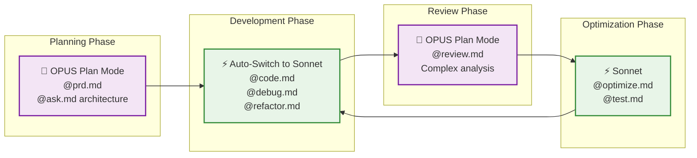
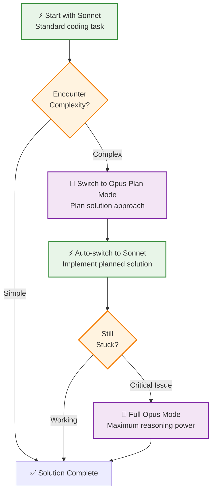

# Strategic Model Selection

Master Claude Code's model selection to optimize performance, cost, and usage limits while maximizing development effectiveness through strategic model switching.

## Model Selection Philosophy

**Right Model for the Right Task**: Each Claude model has unique strengths. Strategic selection maximizes output quality while managing usage limits and costs effectively.

**Plan with Power, Code with Efficiency**: Use high-capability models for complex planning and reasoning, then switch to efficient models for implementation and iteration.

## Available Models & Strategic Use Cases

### 🎯 **Default (Recommended)**
- **Model**: Opus 4.1 up to 50% usage limits, then Sonnet 4
- **Best For**: Balanced approach with automatic optimization
- **Usage Pattern**: General development with built-in limit management

### 🚀 **Opus** 
- **Model**: Opus 4.1 for complex tasks, reaches limits faster
- **Best For**: Complex architecture, critical debugging, advanced problem solving
- **Usage Pattern**: Reserve for challenging tasks requiring maximum reasoning capability

### ⚡ **Sonnet**
- **Model**: Sonnet 4 for daily use
- **Best For**: Coding, refactoring, testing, routine development tasks
- **Usage Pattern**: Primary workhorse for implementation and iteration

### 🎨 **Opus Plan Mode** ⭐ *Recommended Strategy*
- **Model**: Opus 4.1 for planning, Sonnet 4 for execution
- **Best For**: Complex projects requiring detailed planning with efficient implementation
- **Usage Pattern**: Strategic thinking with cost-effective execution

## Editing Mode Control

### Shift+Tab Mode Switching

Claude Code provides powerful mode switching via `Shift+Tab`:

```bash
Shift+Tab → Cycles through editing modes:
1. Default Mode    (Balanced model selection)
2. Opus Mode       (Maximum reasoning power)
3. Sonnet Mode     (Efficient coding focus)  
4. Opus Plan Mode  (Strategic planning + efficient execution)
```

**Pro Tip**: Keep pressing `Shift+Tab` until you see "Opus Plan Mode" for optimal workflow balance.

## Strategic Model Usage Patterns

### Pattern 1: Complex Project Lifecycle



### Pattern 2: Problem-Solving Escalation



## Model-Specific Command Optimization

### 🎨 **Opus Plan Mode - Strategic Commands**

**Ideal Commands**:
- `@prd.md` - Complex product requirements with market analysis
- `@ask.md` - Architectural consultation requiring deep reasoning
- `@state_tracker.md create` - Project phase planning
- `@review.md` - Comprehensive code quality analysis

**Workflow**:
```bash
# Switch to Opus Plan Mode
Shift+Tab (until you see "Opus Plan Mode")

# Strategic planning with Opus reasoning
@prd.md "Advanced Analytics Platform"
@ask.md "What's the best microservices architecture for high-volume data processing?"

# Implementation automatically uses Sonnet
@state_tracker.md create
@state_tracker.md start 1  # Auto-invokes @code.md in Sonnet
```

### ⚡ **Sonnet Mode - Implementation Commands**

**Ideal Commands**:
- `@code.md` - Feature implementation and development
- `@debug.md` - Issue resolution and troubleshooting  
- `@refactor.md` - Code structure improvements
- `@test.md` - Testing strategy and implementation
- `@optimize.md` - Performance improvements

**Workflow**:
```bash
# Switch to Sonnet for efficient coding
Shift+Tab (select "Sonnet")

# High-velocity development
@code.md "User authentication system"
@debug.md "Login validation errors"
@refactor.md "Authentication middleware structure"
@test.md "Authentication flow testing"
```

### 🚀 **Full Opus Mode - Critical Tasks**

**When to Use**:
- Complex architectural decisions with multiple trade-offs
- Critical debugging requiring deep system understanding
- Advanced algorithm implementation
- Integration of complex third-party systems
- Security-critical implementations

**Workflow**:
```bash
# Switch to full Opus for maximum capability
Shift+Tab (select "Opus")

# Critical problem solving
@ask.md "How to implement zero-downtime deployment with database migrations?"
@debug.md "Intermittent race condition in distributed system"
@code.md "Implement custom encryption algorithm with specific requirements"
```

## Strategic Model Selection Guide

### 📊 **Usage Optimization Matrix**

| Task Complexity | Planning Needed | Model Choice | Rationale |
|-----------------|----------------|--------------|-----------|
| **Simple** | Minimal | ⚡ Sonnet | Fast, efficient, cost-effective |
| **Moderate** | Some | 🎯 Default | Balanced approach with auto-optimization |
| **Complex** | Extensive | 🎨 Opus Plan Mode | Strategic planning + efficient execution |
| **Critical** | Deep Analysis | 🚀 Full Opus | Maximum reasoning for critical decisions |

### 🎯 **Command-Model Pairing Recommendations**

#### **Strategic Planning Commands** → **Opus Plan Mode**
```bash
@prd.md          # Product requirements need strategic thinking
@ask.md          # Architectural questions benefit from deep reasoning  
@goals.md        # Project coordination requires comprehensive planning
```

#### **Implementation Commands** → **Sonnet Mode**
```bash
@code.md         # Implementation benefits from efficient, fast iteration
@debug.md        # Most debugging can be handled efficiently  
@refactor.md     # Code improvements work well with Sonnet
@test.md         # Testing strategy implementation is straightforward
```

#### **Quality Analysis Commands** → **Opus Plan Mode**
```bash
@review.md       # Comprehensive analysis benefits from advanced reasoning
@optimize.md     # Performance analysis requires strategic thinking
@deploy-check.md # Deployment validation needs thorough analysis
```

## Advanced Model Switching Techniques

### Technique 1: Context-Aware Switching

**Situation**: Working on a complex feature with multiple phases
```bash
# Start strategic with Opus Plan Mode
@ask.md "What's the best approach for real-time notifications?"

# Switch to Sonnet for implementation  
Shift+Tab (select "Sonnet")
@code.md "Implement WebSocket notification system based on architectural guidance"

# Switch back to Opus Plan Mode for review
Shift+Tab (select "Opus Plan Mode")  
@review.md "WebSocket notification implementation"
```

### Technique 2: Escalation Strategy

**Situation**: Sonnet struggles with a task
```bash
# Start efficient
@code.md "Complex data transformation logic"

# If Sonnet struggles, escalate to Opus Plan Mode
Shift+Tab (select "Opus Plan Mode")
@ask.md "Help me design the data transformation approach"

# If still struggling, go full Opus
Shift+Tab (select "Opus")
@code.md "Implement complex data transformation with detailed guidance"
```

### Technique 3: Session Management

**Situation**: Managing usage limits strategically
```bash
# Morning: Fresh limits, use Opus Plan Mode for key decisions
@prd.md "New feature requirements"
@ask.md "Architecture decisions for new feature"

# Midday: Switch to Sonnet for implementation  
@code.md "Feature implementation"
@test.md "Feature testing"

# Afternoon: Reserve remaining Opus for reviews
@review.md "Feature implementation review"
```

## Best Practices

### 🎯 **Maximize Opus Plan Mode Usage**
- **Primary Strategy**: Use Opus Plan Mode as default for complex projects
- **Benefits**: Strategic planning with efficient execution
- **Cost Efficiency**: Opus reasoning where it matters, Sonnet speed for implementation

### ⚡ **Sonnet Optimization**
- **Coding Tasks**: Sonnet excels at implementation, refactoring, testing
- **Future Potential**: 1M+ token context will make Sonnet even more powerful for coding
- **Iteration Speed**: Fast feedback loops for development and debugging

### 🚀 **Strategic Opus Usage**
- **Reserve for Critical Tasks**: Complex architecture, critical debugging, advanced algorithms
- **Usage Limit Management**: Save Opus for tasks that truly need maximum reasoning
- **Quality Gates**: Use for comprehensive reviews and critical decision points

### 📊 **Session Planning**
- **Start with Strategy**: Begin sessions with architectural planning in Opus Plan Mode
- **Implement Efficiently**: Use Sonnet for bulk implementation work
- **End with Quality**: Reserve Opus capacity for final reviews and validations

## Common Model Selection Anti-Patterns

### ❌ **Opus Waste**
- Using full Opus for simple coding tasks
- Not switching to Sonnet for routine implementation
- Burning through usage limits on straightforward tasks

### ❌ **Sonnet Limitations**
- Forcing Sonnet to handle complex architectural decisions
- Not escalating when Sonnet struggles with complex logic
- Missing opportunities for strategic planning

### ❌ **Mode Switching Neglect**
- Staying in one mode for entire sessions
- Not leveraging Opus Plan Mode's hybrid approach
- Forgetting to check current mode before starting tasks

## Future Model Considerations

### 🔮 **Sonnet Evolution**
- **Expected**: 1M+ token context windows
- **Impact**: Even better for large codebase understanding
- **Strategy**: Will make Sonnet even more powerful for implementation tasks

### 🎯 **Optimal Future Workflow**
```bash
# Strategic planning with maximum reasoning
Opus Plan Mode: @prd.md, @ask.md, @review.md

# Implementation with enhanced context understanding  
Sonnet: @code.md, @debug.md, @refactor.md, @test.md

# Critical decisions with full reasoning power
Full Opus: Complex architecture, critical debugging, advanced algorithms
```

Master strategic model selection to build a development workflow that maximizes both output quality and resource efficiency, ensuring you have the right reasoning power for each phase of your project.