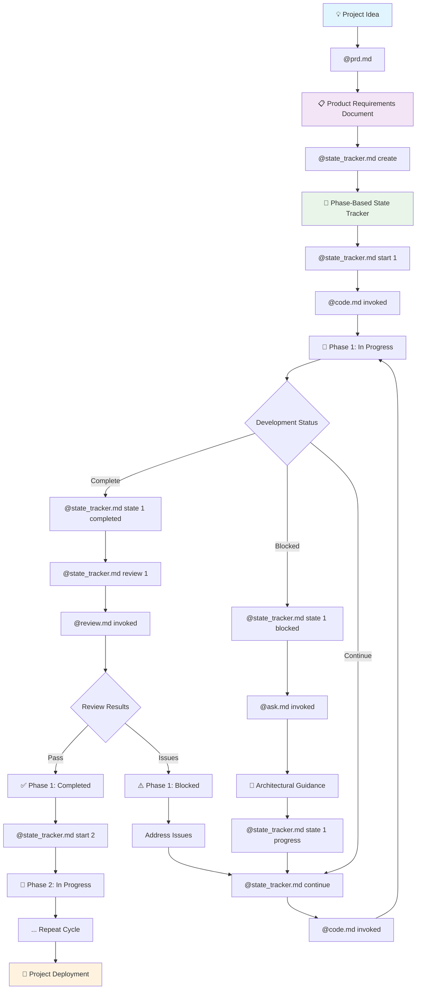

# Project Lifecycle Management

Master the complete development lifecycle using Claude Code's PRD and state tracking commands for systematic project execution from conception to deployment.

## Strategic Framework Overview

### Why Start with a Product Requirements Document?

**Foundation for Success**: A PRD transforms vague ideas into concrete, actionable specifications that prevent scope creep, miscommunication, and development waste.

**Key Benefits**:
- **Clarity & Alignment** - Ensures all stakeholders understand project objectives
- **Risk Mitigation** - Identifies potential challenges before development begins  
- **Resource Planning** - Enables accurate time and effort estimation
- **Quality Gates** - Establishes clear success criteria and acceptance requirements
- **Decision Framework** - Provides context for technical and strategic decisions

### Why Implement Phase-Based State Tracking?

**Visibility & Control**: Breaking complex projects into trackable phases provides granular progress visibility and enables proactive issue management.

**Core Advantages**:
- **Progress Transparency** - Real-time visibility into project advancement
- **Bottleneck Identification** - Quickly spot and address development blockers
- **Team Coordination** - Shared understanding of current priorities and dependencies
- **Quality Assurance** - Built-in review gates prevent technical debt accumulation
- **Stakeholder Communication** - Clear progress reporting for non-technical audiences

## Complete Workflow Architecture



## Command Deep Dive

### @prd.md - Product Requirements Generator

**Purpose**: Transform project ideas into comprehensive product specifications using AI-assisted analysis and strategic thinking.

#### Command Structure
```bash
@prd.md "<PROJECT_DESCRIPTION>"
```

#### Internal Process Flow
1. **Sequential Thinking Activation** - Uses MCP sequential-thinking for systematic analysis
2. **Multi-Agent Coordination** - Orchestrates four specialized advisors:
   - **Problem Analyst** - Identifies core problems and user pain points
   - **Solution Architect** - Designs technical approach and architecture
   - **Market Strategist** - Analyzes competition and market positioning  
   - **Delivery Planner** - Creates timeline and milestone structure

3. **Interactive Questioning** - Fills knowledge gaps through targeted questions
4. **Comprehensive Documentation** - Generates structured PRD with all essential sections

#### Generated PRD Structure
- **Executive Summary** - Project vision and key objectives
- **Problem Statement** - Detailed problem analysis and user pain points
- **Solution Overview** - Technical approach and feature specifications
- **Target Audience** - User personas and market analysis
- **Technical Requirements** - Architecture, integrations, and constraints
- **Timeline & Milestones** - Development phases and delivery schedule
- **Success Metrics** - KPIs and acceptance criteria
- **Risk Analysis** - Potential challenges and mitigation strategies

### @state_tracker.md - Development Workflow Orchestrator

**Purpose**: Create visual phase tracking that integrates with development commands for complete workflow automation.

#### Action Commands Overview

##### create (Default Action)
```bash
@state_tracker.md create "<PROJECT_NAME>"
@state_tracker.md                          # Uses existing PRD
```
- **PRD Integration** - Automatically reads `prd.md` for phase extraction
- **Phase Generation** - Creates 4-8 logical development phases
- **Initial State** - Sets first phase as 🔄 In Progress
- **Rule Establishment** - Creates project tracking guidelines

##### start - Begin Phase Work
```bash
@state_tracker.md start 1              # Start specific phase
@state_tracker.md start                # Start next planned phase
```
- **State Update** - Marks target phase as 🔄 In Progress
- **Code Generation** - Invokes `@code.md` with phase description
- **Progress Tracking** - Updates tracker with timestamps
- **Context Transfer** - Passes phase requirements to implementation

##### continue - Resume Development
```bash
@state_tracker.md continue
```
- **Current Phase Detection** - Identifies active work
- **Context Analysis** - Evaluates progress and blockers
- **Tool Selection** - Chooses appropriate next action:
  - `@ask.md` for architectural guidance when blocked
  - `@code.md` for continued implementation
- **Status Updates** - Refreshes phase notes with current progress

##### skip - Handle Dependencies
```bash
@state_tracker.md skip 3 "API documentation pending"
```
- **Documented Skipping** - Marks phase as ⏭️ Skipped with reason
- **Automatic Advancement** - Moves to next available planned phase
- **Progress Recalculation** - Updates overall completion percentage
- **Dependency Tracking** - Maintains skip reasons for future reference

##### state - Manual State Management
```bash
@state_tracker.md state 1 completed
@state_tracker.md state 2 blocked
```
- **Validation** - Ensures valid phase numbers and state transitions
- **State Transition** - Updates phase to new emoji state
- **Progress Update** - Recalculates project completion percentage
- **Timestamp Logging** - Records when and why state changed

##### review - Quality Assurance
```bash
@state_tracker.md review 1
```
- **Review Initiation** - Marks phase as 🔍 Under Review
- **Code Analysis** - Invokes `@review.md` for comprehensive evaluation
- **Results Integration** - Appends findings to phase documentation
- **Final Assessment** - Sets ✅ Completed or ⚠️ Blocked based on review

##### help - Status & Guidance
```bash
@state_tracker.md help
```
- **Current State Analysis** - Shows all phase statuses and progress
- **Available Actions** - Lists relevant next steps
- **Command Examples** - Provides specific command suggestions
- **Blocker Identification** - Highlights issues requiring attention

## Emoji State System

### Primary States
- 📋 **Planned** - Phase defined, ready to start
- 🔄 **In Progress** - Active development work
- ✅ **Completed** - Phase finished and validated
- 🚀 **Deployed** - Phase delivered to production

### Management States
- ⚠️ **Blocked** - Waiting for dependencies or issue resolution
- 🔍 **Under Review** - Quality assurance in progress
- ⏭️ **Skipped** - Intentionally bypassed with documented reason
- ❌ **Cancelled** - Phase deprioritized or removed

### Valid Transitions
```
📋 → 🔄 → ✅ → 🔍 → ✅ → 🚀    (Normal flow)
🔄 → ⚠️ → 🔄 → ✅             (Blocker resolution)
📋 → ⏭️                       (Dependency skip)
Any → ❌                      (Cancellation)
```

## Real-World Implementation Examples

### SaaS Product Development
```bash
# 1. Strategic Planning
@prd.md "TaskFlow - Advanced Task Management Platform"

# 2. Development Setup
@state_tracker.md create

# 3. Phase Execution
@state_tracker.md start 1        # Architecture phase
@state_tracker.md continue       # Implement core systems
@state_tracker.md state 1 completed
@state_tracker.md review 1       # Quality assurance

# 4. Next Phase
@state_tracker.md start 2        # Backend development
```

### Mobile App Project
```bash
# Handle external dependencies
@state_tracker.md skip 3 "App Store approval process pending"
@state_tracker.md start 4        # Continue with backend work

# Later resume skipped phase
@state_tracker.md state 3 planned
@state_tracker.md start 3
```

### Enterprise Integration
```bash
# Blocker management
@state_tracker.md state 2 blocked
@state_tracker.md continue       # Get architectural guidance
# System invokes @ask.md for technical direction

@state_tracker.md state 2 progress
@state_tracker.md continue       # Resume implementation
```

## Integration Benefits

### 🎯 **Strategic Alignment**
- PRD ensures all development serves business objectives
- Phase tracking maintains focus on deliverable outcomes
- Regular reviews validate progress against initial requirements

### ⚡ **Development Velocity**
- Automated tool integration reduces context switching
- Clear phase boundaries prevent scope creep
- Built-in quality gates catch issues early

### 🤝 **Team Coordination**  
- Shared visibility into project state and priorities
- Standardized workflow across team members
- Clear communication points for stakeholder updates

### 📊 **Quality Assurance**
- Systematic review process for all completed work
- Integrated testing and validation at phase boundaries  
- Technical debt prevention through regular quality checks

### 🔄 **Adaptive Management**
- Flexible handling of changing requirements
- Graceful dependency management with skip/resume
- Real-time project health monitoring

## Best Practices

### PRD Creation
- **Be Specific** - Detailed requirements prevent misinterpretation
- **Include Context** - Business rationale for technical decisions
- **Plan for Change** - Flexible architecture and scope management
- **Define Success** - Clear metrics and acceptance criteria

### State Tracking
- **Single Active Phase** - Maintain focus by limiting work in progress
- **Regular Updates** - Keep state current during development
- **Document Blockers** - Clear communication about impediments
- **Review Everything** - No phase advances without quality validation

### Workflow Integration
- **Trust the Process** - Let automated tool integration guide workflow
- **Maintain Context** - Use phase descriptions to inform implementation
- **Communicate Changes** - Update state tracker during team meetings
- **Celebrate Progress** - Acknowledge completed phases and milestones

This systematic approach transforms chaotic development into predictable, high-quality project delivery through structured planning and intelligent workflow automation.