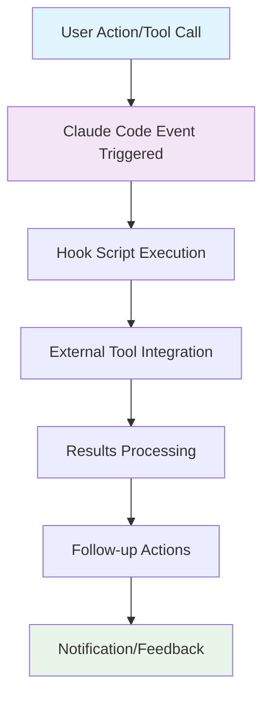

# Hooks: Intelligent Development Automation

Transform your development workflow with Claude Code hooks that respond intelligently to events, integrate seamlessly with tools, and automate complex development processes.

## Overview

Claude Code hooks are powerful automation triggers that execute shell commands in response to specific events during your development session. They enable deep integration with external tools, automated quality gates, and sophisticated workflow orchestration.

**Why Hooks Are Revolutionary:**
- **Event-Driven Automation**: React to development events as they happen
- **Context Awareness**: Access full session context and tool results  
- **External Integration**: Connect with any tool or service via shell commands
- **Workflow Intelligence**: Build sophisticated automation that adapts to your patterns
- **Quality Assurance**: Enforce standards and practices automatically

## Hook Architecture

### Hook Event Lifecycle



### Configuration Structure

Hooks are configured in your Claude Code settings with full access to session context:

```json
{
  "hooks": {
    "user-prompt-submit": "./scripts/session-start.sh",
    "tool-call-complete": "./scripts/tool-complete.sh",
    "edit-complete": "./scripts/code-change.sh", 
    "session-end": "./scripts/session-cleanup.sh",
    "error-occurred": "./scripts/error-handler.sh"
  }
}
```

## Core Hook Types & Events

### Session Management Hooks

#### user-prompt-submit
Triggered when user submits a new prompt or request.

**Use Cases:**
- Session initialization and context loading
- User activity tracking and analytics
- External tool preparation
- Workspace optimization

**Example Implementation:**
```bash
#!/bin/bash
# ~/.claude/hooks/session-start.sh

# Load project context and prepare environment
echo "🚀 Starting Claude Code session at $(date)" >> ~/.claude/session.log

# Check git status and uncommitted changes
if git diff-index --quiet HEAD --; then
    echo "✅ Working directory clean"
else
    echo "⚠️  Uncommitted changes detected"
    git status --short
fi

# Verify development environment
npm --version > /dev/null 2>&1 && echo "✅ Node.js ready" || echo "❌ Node.js not available"
python --version > /dev/null 2>&1 && echo "✅ Python ready" || echo "❌ Python not available"

# Load project-specific environment
if [ -f ".env.development" ]; then
    echo "📋 Loading development environment variables"
fi

# Notify team channel (optional)
if [ "$CLAUDE_TEAM_WEBHOOK" ]; then
    curl -s -X POST "$CLAUDE_TEAM_WEBHOOK" \
         -H "Content-Type: application/json" \
         -d "{\"text\":\"🤖 Claude Code session started: $USER working on $(basename $PWD)\"}"
fi
```

### Tool Execution Hooks

#### tool-call-complete
Triggered after any tool execution completes.

**Advanced Implementation with Tool-Specific Logic:**
```bash
#!/bin/bash
# ~/.claude/hooks/tool-complete.sh

TOOL_NAME="$1"
TOOL_RESULT="$2" 
TOOL_SUCCESS="$3"

case "$TOOL_NAME" in
    "Edit")
        echo "📝 Code change detected"
        
        # Run linting on changed files
        if command -v eslint > /dev/null; then
            echo "🔍 Running ESLint on changed files..."
            git diff --name-only --cached | grep -E '\.(js|ts|jsx|tsx)$' | xargs eslint --fix
        fi
        
        # Update documentation if API changes detected
        if git diff --cached | grep -E "export|function|class" > /dev/null; then
            echo "📚 API changes detected, updating documentation..."
            npm run docs:generate > /dev/null 2>&1 || true
        fi
        
        # Security scan for sensitive files
        if git diff --cached --name-only | grep -E "(auth|security|password|token)" > /dev/null; then
            echo "🔒 Security-related changes detected, running security scan..."
            npm audit --audit-level moderate || echo "⚠️  Security audit found issues"
        fi
        ;;
        
    "Bash")
        echo "⚙️  Command executed: $(echo $TOOL_RESULT | head -c 50)..."
        
        # Monitor for package installation
        if echo "$TOOL_RESULT" | grep -q "npm install\|yarn add\|pip install"; then
            echo "📦 Package installation detected, running security audit..."
            npm audit --audit-level high > /dev/null 2>&1 || pip-audit > /dev/null 2>&1 || true
        fi
        ;;
        
    "Write")
        echo "📄 New file created"
        
        # Auto-format new files
        FILENAME=$(echo "$TOOL_RESULT" | grep -o "File created.*" | sed 's/File created successfully at: //')
        if [[ "$FILENAME" =~ \.(js|ts|jsx|tsx|py|go|rs)$ ]]; then
            echo "✨ Auto-formatting new file: $FILENAME"
            case "$FILENAME" in
                *.js|*.ts|*.jsx|*.tsx) npx prettier --write "$FILENAME" ;;
                *.py) black "$FILENAME" 2>/dev/null || true ;;
                *.go) gofmt -w "$FILENAME" 2>/dev/null || true ;;
                *.rs) rustfmt "$FILENAME" 2>/dev/null || true ;;
            esac
        fi
        ;;
        
    "Read")
        # Track file access patterns for context optimization
        echo "$(date): File read - $(echo $TOOL_RESULT | head -c 100)" >> ~/.claude/file-access.log
        ;;
esac

# Universal post-tool actions
if [ "$TOOL_SUCCESS" = "true" ]; then
    echo "✅ $TOOL_NAME completed successfully"
else
    echo "❌ $TOOL_NAME failed"
    # Log errors for debugging
    echo "$(date): $TOOL_NAME failed - $TOOL_RESULT" >> ~/.claude/errors.log
fi
```

### Workflow Integration Hooks

#### edit-complete
Specialized hook for code changes with sophisticated automation.

```bash
#!/bin/bash
# ~/.claude/hooks/edit-complete.sh

CHANGED_FILE="$1"
CHANGE_TYPE="$2"  # create, modify, delete

echo "🔄 Processing code change in $CHANGED_FILE"

# Language-specific processing
case "$CHANGED_FILE" in
    *.js|*.ts|*.jsx|*.tsx)
        echo "🟨 JavaScript/TypeScript change detected"
        
        # Run type checking for TypeScript
        if [[ "$CHANGED_FILE" =~ \.(ts|tsx)$ ]]; then
            npx tsc --noEmit --project . || echo "⚠️  TypeScript errors detected"
        fi
        
        # Run related tests
        TEST_FILE=$(echo "$CHANGED_FILE" | sed 's/\.(js|ts|jsx|tsx)$/.test.$1/')
        if [ -f "$TEST_FILE" ]; then
            echo "🧪 Running related tests..."
            npm test -- "$TEST_FILE" --passWithNoTests
        fi
        
        # Bundle size impact analysis
        if npm run build:analyze > /dev/null 2>&1; then
            echo "📊 Analyzing bundle size impact..."
        fi
        ;;
        
    *.py)
        echo "🐍 Python change detected"
        
        # Run type checking with mypy
        mypy "$CHANGED_FILE" 2>/dev/null || echo "ℹ️  MyPy type checking skipped"
        
        # Security scanning with bandit
        bandit -f txt "$CHANGED_FILE" 2>/dev/null || echo "ℹ️  Security scan skipped"
        
        # Code quality with flake8
        flake8 "$CHANGED_FILE" || echo "⚠️  Code quality issues detected"
        ;;
        
    *.go)
        echo "🔵 Go change detected"
        go fmt "$CHANGED_FILE"
        go vet "$CHANGED_FILE" || echo "⚠️  Go vet found issues"
        ;;
        
    *.rs)
        echo "🦀 Rust change detected"
        rustfmt "$CHANGED_FILE"
        cargo check || echo "⚠️  Rust compilation issues"
        ;;
        
    *Dockerfile*|docker-compose.yml)
        echo "🐳 Docker configuration change detected"
        
        # Validate Dockerfile syntax
        docker build --no-cache -t temp-validation . > /dev/null 2>&1 || echo "⚠️  Docker build validation failed"
        
        # Security scanning with Trivy
        if command -v trivy > /dev/null; then
            trivy filesystem . > /dev/null 2>&1 || echo "ℹ️  Container security scan completed"
        fi
        ;;
        
    package.json|requirements.txt|go.mod|Cargo.toml)
        echo "📦 Dependency change detected"
        
        # Run security audit
        case "$CHANGED_FILE" in
            package.json) npm audit --audit-level moderate ;;
            requirements.txt) safety check --json || echo "ℹ️  Python security check skipped" ;;
            go.mod) nancy sleuth || echo "ℹ️  Go security check skipped" ;;
            Cargo.toml) cargo audit || echo "ℹ️  Rust security check skipped" ;;
        esac
        
        # Update lock files
        case "$CHANGED_FILE" in
            package.json) npm install ;;
            requirements.txt) pip install -r requirements.txt ;;
        esac
        ;;
esac

# Universal change processing
# Update modification timestamp for tracking
echo "$(date): $CHANGED_FILE modified" >> ~/.claude/modifications.log

# Git integration
if git rev-parse --git-dir > /dev/null 2>&1; then
    # Check if file should be staged
    if git diff --name-only "$CHANGED_FILE" > /dev/null 2>&1; then
        echo "📋 File ready for git staging"
        
        # Auto-stage if following conventional patterns
        if [[ "$CHANGED_FILE" =~ \.(md|json|txt)$ ]]; then
            git add "$CHANGED_FILE"
            echo "✅ Auto-staged documentation/configuration file"
        fi
    fi
fi
```

### Error Handling & Recovery Hooks

#### error-occurred
Triggered when Claude Code encounters errors during operation.

```bash
#!/bin/bash
# ~/.claude/hooks/error-handler.sh

ERROR_TYPE="$1"
ERROR_MESSAGE="$2"
CONTEXT="$3"

echo "🚨 Error detected: $ERROR_TYPE"

# Log error with full context
ERROR_LOG="$HOME/.claude/errors.log"
cat >> "$ERROR_LOG" << EOF
$(date -Iseconds): $ERROR_TYPE
Message: $ERROR_MESSAGE
Context: $CONTEXT
Working Directory: $(pwd)
Git Branch: $(git rev-parse --abbrev-ref HEAD 2>/dev/null || "N/A")
---
EOF

# Error-specific handling
case "$ERROR_TYPE" in
    "tool_execution_failed")
        echo "🔧 Tool execution failed, attempting recovery..."
        
        # Check system resources
        echo "💾 Available disk space: $(df -h . | tail -1 | awk '{print $4}')"
        echo "🧠 Available memory: $(free -h | grep '^Mem:' | awk '{print $7}' 2>/dev/null || echo 'N/A')"
        
        # Check for common issues
        if [[ "$ERROR_MESSAGE" =~ "permission denied" ]]; then
            echo "🔒 Permission issue detected. Checking file permissions..."
            ls -la . | head -10
        elif [[ "$ERROR_MESSAGE" =~ "command not found" ]]; then
            echo "❓ Command not found. Checking PATH and available tools..."
            echo "PATH: $PATH"
            which node npm python pip || true
        fi
        ;;
        
    "file_operation_failed")
        echo "📁 File operation failed"
        
        # Check file system status
        if [[ "$ERROR_MESSAGE" =~ "No such file" ]]; then
            echo "🔍 File not found. Checking directory structure..."
            find . -maxdepth 3 -type f -name "*.js" -o -name "*.py" -o -name "*.ts" | head -10
        fi
        ;;
        
    "network_error")
        echo "🌐 Network error detected"
        
        # Check connectivity
        ping -c 1 8.8.8.8 > /dev/null 2>&1 && echo "✅ Internet connectivity OK" || echo "❌ Network connectivity issue"
        ;;
esac

# Automated recovery attempts
case "$ERROR_TYPE" in
    "dependency_error")
        echo "📦 Attempting dependency recovery..."
        
        if [ -f "package.json" ]; then
            echo "🔄 Reinstalling Node.js dependencies..."
            rm -rf node_modules package-lock.json
            npm install
        fi
        
        if [ -f "requirements.txt" ]; then
            echo "🔄 Reinstalling Python dependencies..."
            pip install -r requirements.txt --force-reinstall
        fi
        ;;
esac

# Notification for critical errors
if [[ "$ERROR_TYPE" =~ (security|critical|system) ]]; then
    echo "🚨 Critical error - sending notification..."
    
    if [ "$CLAUDE_ALERT_WEBHOOK" ]; then
        curl -s -X POST "$CLAUDE_ALERT_WEBHOOK" \
             -H "Content-Type: application/json" \
             -d "{\"text\":\"🚨 Claude Code Critical Error: $ERROR_TYPE in $(basename $PWD)\"}"
    fi
fi

echo "📋 Error logged to $ERROR_LOG"
```

## Advanced Integration Patterns

### CI/CD Pipeline Integration

```bash
#!/bin/bash
# ~/.claude/hooks/cicd-integration.sh

# Trigger CI pipeline when significant changes detected
if git diff --cached --name-only | wc -l | awk '{print ($1 > 5)}' | grep -q 1; then
    echo "🏗️  Significant changes detected, triggering CI pipeline..."
    
    # GitHub Actions workflow dispatch
    if [ "$GITHUB_TOKEN" ] && [ "$GITHUB_REPO" ]; then
        curl -X POST \
             -H "Authorization: token $GITHUB_TOKEN" \
             -H "Accept: application/vnd.github.v3+json" \
             "https://api.github.com/repos/$GITHUB_REPO/actions/workflows/ci.yml/dispatches" \
             -d '{"ref":"main"}'
    fi
    
    # Jenkins pipeline trigger
    if [ "$JENKINS_URL" ] && [ "$JENKINS_TOKEN" ]; then
        curl -X POST "$JENKINS_URL/job/claude-code-integration/buildWithParameters" \
             --user "$JENKINS_USER:$JENKINS_TOKEN" \
             --data-urlencode "BRANCH=$(git rev-parse --abbrev-ref HEAD)"
    fi
fi
```

### Slack/Discord Team Integration

```bash
#!/bin/bash
# ~/.claude/hooks/team-integration.sh

ACTION="$1"
DETAILS="$2"

case "$ACTION" in
    "session-start")
        MESSAGE="🤖 Claude Code session started by $USER on $(basename $PWD)"
        ;;
    "significant-change")
        CHANGED_FILES=$(git diff --name-only --cached | wc -l)
        MESSAGE="📝 Significant code changes: $CHANGED_FILES files modified in $(basename $PWD)"
        ;;
    "deployment")
        MESSAGE="🚀 Deployment initiated from Claude Code session"
        ;;
    "error")
        MESSAGE="🚨 Error in Claude Code session: $DETAILS"
        ;;
esac

# Slack notification
if [ "$SLACK_WEBHOOK_URL" ]; then
    curl -X POST -H 'Content-type: application/json' \
         --data "{\"text\":\"$MESSAGE\"}" \
         "$SLACK_WEBHOOK_URL"
fi

# Discord notification  
if [ "$DISCORD_WEBHOOK_URL" ]; then
    curl -X POST -H 'Content-type: application/json' \
         --data "{\"content\":\"$MESSAGE\"}" \
         "$DISCORD_WEBHOOK_URL"
fi
```

### Development Metrics Collection

```bash
#!/bin/bash
# ~/.claude/hooks/metrics-collector.sh

METRIC_TYPE="$1"
METRIC_VALUE="$2"

METRICS_FILE="$HOME/.claude/metrics.jsonl"

# Create metrics entry
METRIC_ENTRY=$(cat << EOF
{
  "timestamp": "$(date -Iseconds)",
  "type": "$METRIC_TYPE", 
  "value": "$METRIC_VALUE",
  "project": "$(basename $PWD)",
  "branch": "$(git rev-parse --abbrev-ref HEAD 2>/dev/null || 'unknown')",
  "user": "$USER"
}
EOF
)

echo "$METRIC_ENTRY" >> "$METRICS_FILE"

# Send to analytics service
if [ "$ANALYTICS_ENDPOINT" ]; then
    curl -s -X POST "$ANALYTICS_ENDPOINT" \
         -H "Content-Type: application/json" \
         -d "$METRIC_ENTRY" || true
fi
```

### Automated Testing & Quality Gates

```bash
#!/bin/bash
# ~/.claude/hooks/quality-gates.sh

# Comprehensive quality checking
echo "🔍 Running quality gates..."

EXIT_CODE=0

# Code quality checks
if command -v eslint > /dev/null; then
    echo "📋 Running ESLint..."
    if ! eslint . --ext .js,.ts,.jsx,.tsx; then
        echo "❌ ESLint failed"
        EXIT_CODE=1
    fi
fi

# Security scanning
if command -v npm > /dev/null; then
    echo "🔒 Running security audit..."
    if ! npm audit --audit-level moderate; then
        echo "❌ Security vulnerabilities detected"
        EXIT_CODE=1
    fi
fi

# Test coverage
if [ -f "jest.config.js" ] || [ -f "package.json" ]; then
    echo "🧪 Checking test coverage..."
    if ! npm test -- --coverage --coverageThreshold='{"global":{"branches":80,"functions":80,"lines":80,"statements":80}}'; then
        echo "❌ Test coverage below threshold"
        EXIT_CODE=1
    fi
fi

# Performance budgets
if [ -f "webpack.config.js" ] && command -v bundlesize > /dev/null; then
    echo "📊 Checking bundle size..."
    if ! bundlesize; then
        echo "❌ Bundle size exceeds budget"
        EXIT_CODE=1
    fi
fi

if [ $EXIT_CODE -eq 0 ]; then
    echo "✅ All quality gates passed"
else
    echo "❌ Quality gates failed"
    
    # Block certain operations on failure
    if [ "$CLAUDE_STRICT_QUALITY" = "true" ]; then
        echo "🚫 Strict quality mode enabled - blocking operation"
        exit 1
    fi
fi
```

## Hook Management & Best Practices

### Hook Organization

```bash
# Recommended hook directory structure
~/.claude/
├── hooks/
│   ├── core/                    # Essential hooks
│   │   ├── session-start.sh
│   │   ├── tool-complete.sh
│   │   └── error-handler.sh
│   ├── integrations/           # External tool integrations
│   │   ├── slack-notify.sh
│   │   ├── github-actions.sh
│   │   └── monitoring.sh
│   ├── quality/                # Quality assurance hooks
│   │   ├── lint-check.sh
│   │   ├── test-runner.sh
│   │   └── security-scan.sh
│   └── utils/                  # Utility functions
│       ├── common-functions.sh
│       └── notification-lib.sh
└── config/
    └── hooks.json              # Hook configuration
```

### Hook Testing & Debugging

```bash
#!/bin/bash
# ~/.claude/hooks/test-hooks.sh

# Test hook execution in isolation
echo "🧪 Testing Claude Code hooks..."

# Mock environment variables
export CLAUDE_TEST_MODE="true"
export TOOL_NAME="Edit"
export TOOL_RESULT="Test file modification"
export TOOL_SUCCESS="true"

# Test each hook
for hook in ~/.claude/hooks/*.sh; do
    if [ -x "$hook" ]; then
        echo "Testing $(basename $hook)..."
        timeout 10 "$hook" "test-tool" "test-result" "true" || echo "⚠️  Hook timeout or failure"
    fi
done

echo "✅ Hook testing complete"
```

### Performance Optimization

```bash
#!/bin/bash
# ~/.claude/hooks/performance-monitor.sh

START_TIME=$(date +%s.%N)

# Your hook logic here
# ... 

END_TIME=$(date +%s.%N)
EXECUTION_TIME=$(echo "$END_TIME - $START_TIME" | bc)

# Log performance metrics
echo "$(date -Iseconds): Hook execution time: ${EXECUTION_TIME}s" >> ~/.claude/hook-performance.log

# Alert on slow hooks
if (( $(echo "$EXECUTION_TIME > 5.0" | bc -l) )); then
    echo "⚠️  Slow hook detected: ${EXECUTION_TIME}s execution time"
fi
```

These hooks transform Claude Code from a powerful development tool into an intelligent, automated development environment that learns and adapts to your workflow patterns while maintaining the highest quality standards.